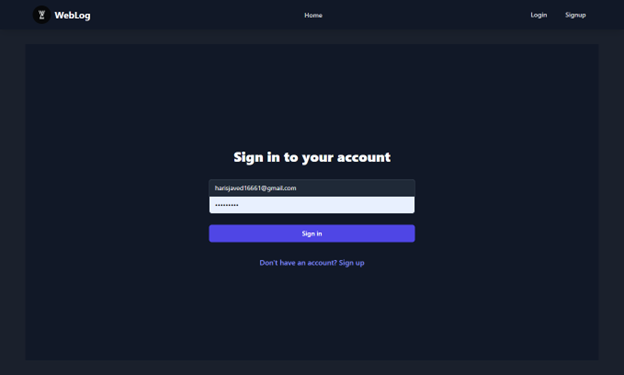
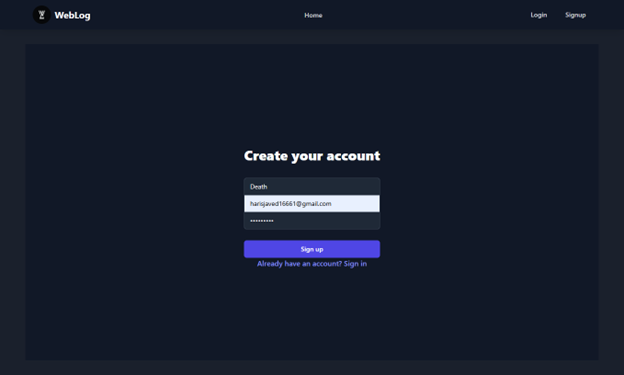
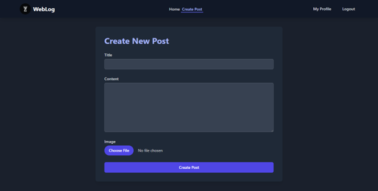
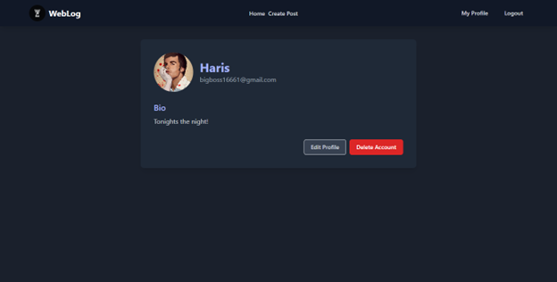

npm i (in backend and frontend)
node server.js (backend)
npm start (frontend)

add your own database script in .env file

Homepage: 

Login Page: 

 
Signup Page: 

 
Create Post Page: 

 
Post Detail Page: 

 
Profile Page: 

 
